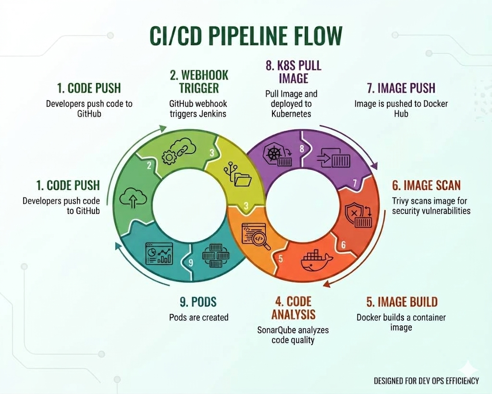

## CloudVault - AWS Cloud-Native 3-Tier DevSecOps File Storage Platform

CloudVault is a cloud-native file storage application inspired by services such as Google Drive and iCloud.

The project demonstrates end-to-end DevSecOps practices by integrating Infrastructure as Code (IaC), CI/CD automation, containerization, Kubernetes orchestration, security scanning, and AWS cloud services.

## Project Overview

CloudVault enables users to upload and manage files through a web interface. Uploaded files are stored in Amazon S3, while file metadata is maintained in Amazon RDS MySQL.

The entire infrastructure is provisioned using Terraform, configured using Ansible, and deployed through an automated Jenkins CI/CD pipeline, ensuring a scalable, secure, and cloud-native deployment workflow. 

## AWS Architecture

**[Read aws architecture in detailed. ](architecture/architecture.md)**

## Project Features

- Infrastructure provisioning using Terraform
- Configuration management using Ansible
- Automated CI/CD pipeline using Jenkins
- Static code analysis using SonarQube
- Container vulnerability scanning using Trivy
- Docker containerization
- Kubernetes orchestration
- ConfigMap and Secret-based configuration management
- Amazon S3 integration for file storage
- Amazon RDS MySQL integration for metadata storage
- CloudFront content delivery integration

## Project Flow 
**User → CloudFront → Application Load Balancer → Kubernetes Worker Nodes → Flask Pods → Amazon S3 (File Storage) + Amazon RDS MySQL (Metadata Storage)**

## Tech Stack

### AWS Services

| AWS Service | Purpose |
|-------------|----------|
| CloudFront | Delivers application content globally with low latency |
| Public Application Load Balancer (ALB) | Distributes incoming traffic across Kubernetes worker nodes |
| VPC | Provides an isolated network environment for all resources |
| Public Subnets | Host the Public ALB |
| Private Web Subnets | Host Kubernetes worker nodes and application workloads |
| Private App Subnets | Host backend infrastructure and future application tier resources |
| Security Groups | Control inbound and outbound traffic between application components |
| EC2 Instances | Host Jenkins, SonarQube, Kubernetes Control Plane, and Worker Nodes |
| Auto Scaling Groups (ASG) | Automatically manage and scale worker nodes |
| IAM Roles | Provide secure access to AWS services |
| IAM Instance Profiles | Attach IAM permissions to EC2 instances |
| Amazon S3 | Store uploaded files and images |
| Amazon RDS MySQL | Store file metadata and application data |

### DevSecOps Tools

| Tool | Purpose |
|------|---------|
| Amazon Linux 2023 | Base operating system for EC2 instances |
| Terraform | Provision and manage AWS infrastructure |
| Ansible | Automate server configuration and software installation |
| Git | Source code management |
| GitHub | Store application and infrastructure code |
| Jenkins | Automate build, test, and deployment workflows |
| SonarQube | Static code analysis and quality checks |
| Trivy | Container image vulnerability scanning |
| Docker Hub | Store and distribute Docker images |
| Kubernetes (Kubeadm) | Deploy and manage containerized workloads |
| Prometheus | Collect infrastructure and application metrics |
| Grafana | Create monitoring dashboards and visualizations |

## Kubernetes Resources

| Resource | Purpose |
|----------|---------|
| Namespace | Logical isolation of application resources |
| Deployment | Manages application pods and replicas |
| Service | Exposes application within the cluster |
| ConfigMap | Stores non-sensitive configuration |
| Secret | Stores sensitive configuration securely |

## CI/CD Pipeline Flow

**GitHub → Jenkins → SonarQube → Docker Build → Trivy Scan → Docker Hub → Kubernetes Deployment**

## Future Enhancements

- Split the application into frontend and backend microservices.
- Implement a complete AWS 3-tier architecture.
- Add Kubernetes Ingress Controller.
- Implement Horizontal Pod Autoscaler (HPA).
- Integrate AWS Secrets Manager for secret management.
- Integration with AI-Powered Log Analysis for real-time monitoring and troubleshooting.

## Project Status
✓ Infrastructure Provisioned with Terraform  
✓ Server Configuration Automated with Ansible  
✓ CI/CD Pipeline Implemented with Jenkins  
✓ Dockerized Application Deployment  
✓ Kubernetes Orchestration  
✓ SonarQube & Trivy Integration  
✓ Amazon S3 File Storage  
✓ Amazon RDS MySQL Metadata Storage  
✓ ALB Integration

## Author

**Satish Pathade**  
AWS Cloud & DevOps Engineer  
Email: [pathadesatish0@gmail.com](mailto:pathadesatish0@gmail.com)