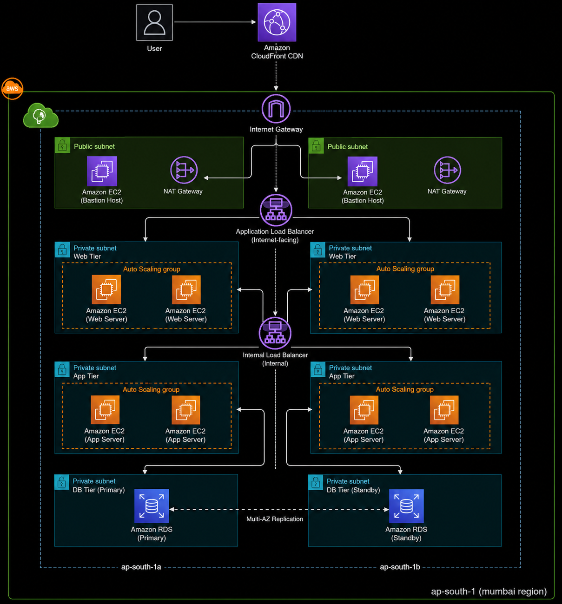

# Architecture

CloudVault is a cloud-native 3-tier file storage platform built on AWS using Infrastructure as Code (Terraform) and configured with Ansible, with delivery automated through Jenkins.
The application runs on Kubernetes, stores uploaded files in Amazon S3, and saves file metadata in Amazon RDS (MySQL).

The architecture is designed to be modular, secure, scalable, and easy to maintain while keeping AWS costs under control.

---

## Architecture Diagram

## Architecture Layers

## EC2 Instance Structure - v1.0

CloudVault v1.0 uses three EC2 instances. The CI/CD server manages the deployment pipeline and Kubernetes control plane, while two worker nodes host the application.

| EC2 Instance | Instance Type | Hosted Services | Purpose |
|-------------|---------------|-----------------|---------|
| **CI/CD Server** | c7i-flex.large | Jenkins, SonarQube, Docker, Ansible, Trivy, Kubernetes Control Plane (`kubeadm`) | Builds, tests, scans, and deploys the application while managing the Kubernetes cluster. |
| **Worker Node 1** | t3.small | Docker, Kubernetes Worker (`kubelet`), Flask Application Pods | Hosts CloudVault application workloads and serves user requests. |
| **Worker Node 2** | t3.small | Docker, Kubernetes Worker (`kubelet`), Flask Application Pods | Provides high availability and scales application workloads alongside Worker Node 1. |

## Design Decisions

- **c7i-flex.large** was selected for the CI/CD server because Jenkins and SonarQube require more memory than CPU. The additional 8 GiB RAM provides smoother builds and analysis.
- **t3.small** instances were selected for Kubernetes worker nodes because they are cost-effective for development, testing, and portfolio-scale workloads while providing sufficient resources for the application pods.
- The architecture can be scaled by upgrading worker nodes or enabling Auto Scaling Groups as workload increases.

> **Note:** The Kubernetes control plane is hosted on the CI/CD server, while application workloads run on the worker nodes in the Web and Application tiers.
> **Note:** The infrastructure is designed to scale by upgrading instance types or adding additional Kubernetes worker nodes as application traffic and resource requirements grow.

---

## Infrastructure Specifications

| Component | Specification |
|----------|---------------|
| **Cloud Provider** | AWS |
| **AWS Region** | ap-south-1 (Mumbai) |
| **Architecture** | Cloud-Native 3-Tier Architecture |
| **Availability Zones** | 2 |
| **VPC CIDR** | `10.0.0.0/16` |
| **Public Subnets** | `10.0.0.0/20`, `10.0.16.0/20` |
| **Private Web Subnets** | `10.0.32.0/20`, `10.0.48.0/20` |
| **Private App Subnets** | `10.0.64.0/20`, `10.0.80.0/20` |
| **Private Database Subnets** | `10.0.96.0/20`, `10.0.112.0/20` |
| **Kubernetes Cluster** | 1 Control Plane, 2 Worker Nodes |
| **Database** | Amazon RDS MySQL |
| **Object Storage** | Amazon S3 |
| **Content Delivery** | Amazon CloudFront |

## Infrastructure Provisioning

All AWS infrastructure is provisioned using reusable Terraform modules.

| Terraform Module | Resources Created |
|------------------|------------------|
| **vpc** | VPC, Subnets, Route Tables, Internet Gateway, NAT Gateway |
| **security-groups** | Security Groups for ALB, EC2, RDS and CI/CD |
| **iam** | IAM Roles, Policies and Instance Profiles |
| **public-alb** | Public Application Load Balancer |
| **internal-alb** | Internal Application Load Balancer |
| **asg** | Launch Templates and Auto Scaling Groups |
| **cicd-server** | Jenkins EC2 Instance |
| **rds** | Amazon RDS MySQL |
| **s3** | Amazon S3 Bucket |
| **cloudfront** | CloudFront Distribution |

---

## Configuration & Deployment

After Terraform creates the infrastructure, Ansible configures all EC2 instances.

| Tool | Purpose |
|------|---------|
| **Ansible** | Server configuration and software installation |
| **Docker** | Containerizes the application |
| **Kubernetes** | Container orchestration |
| **Jenkins** | CI/CD automation |
| **SonarQube** | Static code quality analysis |
| **Trivy** | Container image security scanning |
| **Prometheus** | Metrics collection |
| **Grafana** | Monitoring dashboards |

---

## CI/CD Workflow
**GitHub - Jenkins - SonarQube Analysis - Docker build - Trivy Scan - Docker Hub push - Kubernetes Deploy - CloudVault Application**

---

## Kubernetes Components

| Component | Purpose |
|-----------|---------|
| Deployment | Runs application pods |
| Service | Exposes the application inside the cluster |
| Ingress | Routes external traffic to the application |
| Horizontal Pod Autoscaler (HPA) | Automatically scales application pods |
| ConfigMap | Stores application configuration |
| Secret | Stores sensitive information |
| Calico | Provides Kubernetes networking |

---

## Security

CloudVault follows security best practices throughout the infrastructure.

- IAM Roles with least-privilege access
- Security Groups for network isolation
- Private subnets for application and database tiers
- AWS Secrets Manager for sensitive credentials
- SonarQube for source code analysis
- Trivy for container vulnerability scanning
- Encrypted storage using Amazon S3 and Amazon RDS

---

## Monitoring

| Tool | Purpose |
|------|---------|
| Prometheus | Collects infrastructure and application metrics |
| Grafana | Visualizes metrics through dashboards |

---

## Cost Optimization

The infrastructure is designed to provide a balance between performance and cost by selecting instance types based on workload requirements.

| Optimization | Description |
|--------------|-------------|
| Right-Sized Instances | `m7i-flex.large` for the CI/CD server and `t3.small` for Kubernetes worker nodes. |
| Managed Services | Uses Amazon RDS, S3, and CloudFront to reduce operational overhead. |
| Infrastructure as Code | Terraform enables consistent deployments and prevents unnecessary resource creation. |
| Containerization | Kubernetes efficiently utilizes worker node resources and supports future scaling. |

### Estimated Infrastructure Cost

| Resource | Estimated Cost |
|----------|---------------:|
| **Per Hour** | **~₹16–18** |
| **Per Day** | **~₹390–430** |

> **Note:** Costs are approximate for the Mumbai (`ap-south-1`) region and may vary based on storage, data transfer, and actual AWS usage.